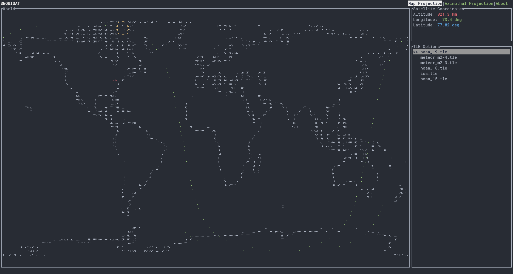

# Sequisat
Satellite positioning system using propagation models, currently the only one implemented is SP4 for low earth orbiting satellites. Allows for viewing the predicted trajectory in the mercator projection as well as a stereographic projection given the provided coordinates.
# Map

# Stereographic projection

# Data provided by the TLE.

# Usage
You can either compile it with `cargo build --release` or download the ejecutable from the releases tab, currently only linux is supported.
The ejecutable requires one or more .tle files to be in the same directory to run correctly, the tle's can be found on the celestrak website. Currently, the used is required to input its coordinates manually.

This programs aims to be entirely offline, giving the user the option to update the TLE's of their desired satellites. Currently a WIP, but feel free to test it out. :D
